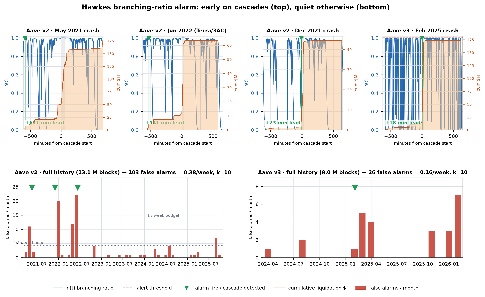
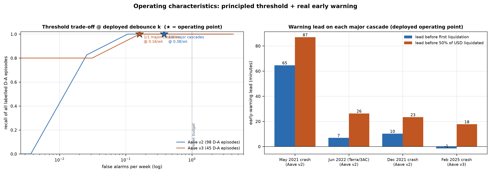
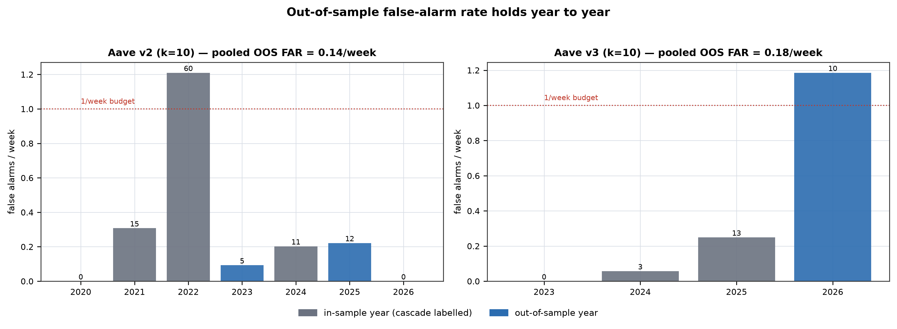
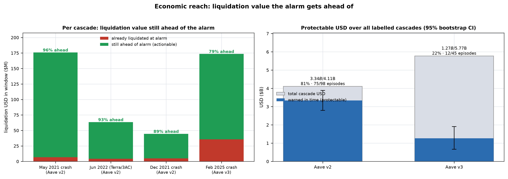
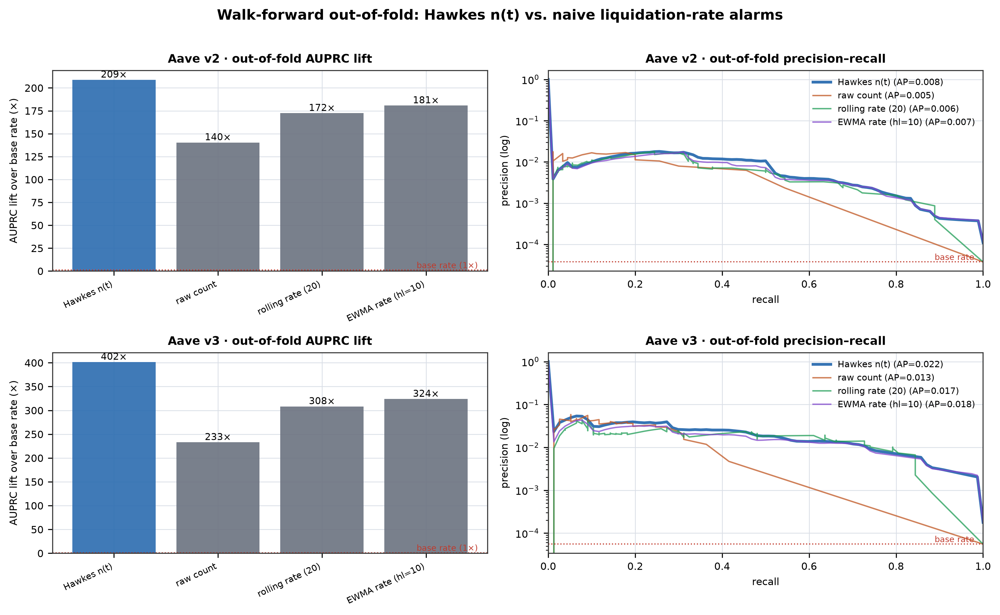

# CascadeSignal

[Krishaay Jois](https://github.com/kry0sc0pic) · [Ansh Parmar](https://github.com/AnshParmar123) · [Abhyuday Sengar](https://github.com/Abh-Sen)

**An early-warning system for liquidation cascades in DeFi lending.**

CascadeSignal turns a protocol's live liquidation stream into a single scalar alarm — the Hawkes branching ratio `n(t) ∈ [0, 1)` — that rises *before* a cascade and stays quiet the rest of the time. It runs on nothing but `LiquidationCall` events: no price oracle, no state reconstruction, no privileged data required.

Built and validated on Aave v2 and Aave v3 (Ethereum mainnet, 2020–2026), with cross-protocol transfer demonstrated on Compound v2 and Maker.

---

## The problem

DeFi lending cascades are self-reinforcing: a price drop forces liquidations, which dump collateral, which drops prices further. By the time a cascade is visible it is already largely irreversible.



\$4.11B liquidated across 49,331 events on Aave v2 alone — concentrated into a handful of crashes.

---

## How it works

The liquidation stream is modelled as a **self-exciting (Hawkes) point process**. The branching ratio `n(t) = α·R / (μ + α·R)` measures how much of each new liquidation is triggered by prior ones. When `n(t) → 1` the process is near-critical and self-feeding — the condition of a cascade.

Two design choices beyond the baseline count Hawkes:

1. **USD-marked blend** — excitation is driven by `count + 0.5·(usd / scale)`, making the signal sensitive to dollar volume rather than flurries of dust liquidations.
2. **Tolerant debounce** — fire once `k = 10` of the last `W = 100` bars cross the threshold, so a flickering near-critical run-up fires once rather than late and repeatedly.

---

## Results

| Chain | Threshold | FAR (full) | FAR (out-of-sample) | Recall | Major cascades | Protectable USD |
|---|---|---|---|---|---|---|
| Aave v2 | 0.99900 | **0.38 / wk** | **0.14 / wk** | 98 / 98 | 3 / 3 | **81%** ($3.34B / $4.11B) |
| Aave v3 | 0.99980 | **0.16 / wk** | **0.18 / wk** | 45 / 45 | 1 / 1 | **22%** ($1.27B / $5.77B) |

- **4 / 4 major cascades caught** across both chains, 100% episode recall.
- Both chains well under a 1 false alarm / week budget.
- Median lead: **+6.5 min before onset**, **+10 min before 10% of dollar damage**, **+19 min before half**.

### Operating characteristics



The starred operating points sit below the 1/week budget with full recall on major cascades. Lead ranges from 7–65 minutes before onset on Aave v2; the fast Aave v3 episode is detected at onset (the liquidation stream has no earlier signal to fire on).

### Out-of-sample robustness



Out-of-sample years (unseen during calibration) are no worse than in-sample. Pooled OOS FAR is 0.14/wk on v2 and 0.18/wk on v3. The single above-budget year (v3 2026) coincides with genuine market-wide deleveraging — likely an undercount of *true* positives rather than noise.

### Economic reach



The alarm gets ahead of **79–96% of the liquidated USD** for each major cascade, and **\$3.34B of \$4.11B (81%)** in aggregate on Aave v2. These are upper bounds assuming instant intervention on every timely alarm.

### USD-marking vs. count baseline



USD-marking lifts recall from 0.86 → 1.00 on Aave v2 and 0.80 → 1.00 on Aave v3 at every false-alarm rate. At the 1/week budget the count model does not reach full recall; the USD-marked model does.

---

## Repository layout

```
src/cascadesignal/       Python package
  models/                Hawkes point process + liquidation-bar builder
  live/                  Live monitor: FastAPI app, web UI, state
  labels/                Cascade labeler (ADR-001 D-A episodes)
  state/, graph/         Position-state engine + contagion graph (roadmap)
  ingest/, eval/, viz/   Data ingestion, evaluation, plotting
scripts/
  run_cascade_labeler.py Builds the frozen ground-truth episodes
  live/                  bootstrap_fit · calibrate_thresholds · run_monitor
  paper/                 Paper figure generators (fig1–fig8)
experiments/             Frozen research experiments (E1 atlas, E3 Hawkes eval, T2 state gate)
docs/decisions/          Architecture Decision Records (ADR-001–008)
paper/                   LaTeX research paper
```

